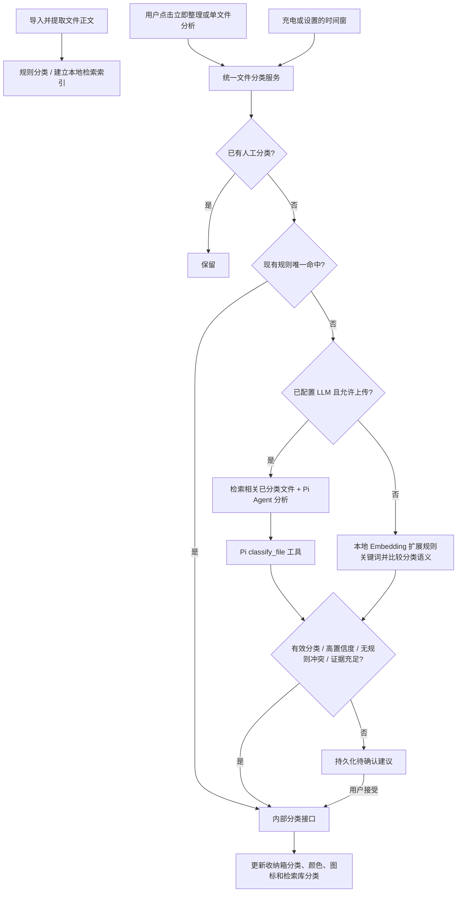

# 当前 LLM-RAG 文件分类策略

更新：2026-09-05。本次以“文件分类”为主流程，后台和用户手动操作共用 `FileOrganizeService`。

## 分类决策

- 候选分类来自用户实际的分类列表，包含当前使用场景及自定义分类。模型不能凭空创建分类。
- 首页规则、人工确认和 AI 分类使用 `ClassificationRules` 共用的匹配及分类应用接口。内容关键词现在参与匹配，标题、正文和格式条件之间为 AND，同一条件内的关键词为 OR。当前规则模型没有文件大小条件字段。
- 有效人工分类优先保留。唯一规则命中直接应用；规则命中多个目标时，模型的高置信度也不能绕过人工确认。
- 有可用配置且已授权时，RAG 检索最多 3 个相关、已分类且仍在收纳箱中的文件作为参考。Pi Agent 必须调用 `classify_file` 工具，最终写入由应用内部接口执行。
- 无 LLM 配置或没有上传许可时，在手机上使用 BGE Embedding 扩展当前分类规则的关键词，再比较文件与分类描述的语义。格式条件仍作为硬约束。
- LLM 分值至少 0.85、本地余弦相似度至少 0.72，且本地第一与第二候选差值至少 0.08，才允许自动应用。分值不是已校准概率；这些阈值需要以后用标注文件集验证和调优。
- 无效目标、规则冲突、证据不足、低分或接近的候选进入待确认。模型不可用时仍可执行精确规则，其余交人工确认。
- 工具调用时重新核对文件 URI、文件内容/分类指纹和规则指纹。分析期间发生手动改类、删除、规则变更，旧结果不能覆盖新状态。
- 收纳箱 preferences 为分类事实来源；SQLite 分类是检索投影，通过 URI 对齐 UI ID 与数据库 ID。自动 AI 分类单独标记，不伪装成人工操作；首页重新应用规则时保留无冲突的有效 AI 分类。

## 后台与手动触发

- 手动整理不受时间窗限制，批量每次最多 20 个；会先停止正在运行的后台整理再接管。手动批量可立即重试失败项，单文件按钮可重新分析待确认文件。
- 后台默认启用、充电触发启用，默认时间窗 02:00–04:00；在智能分类页可修改，支持跨午夜。
- WorkScheduler 分别注册充电任务和每 20 分钟的延迟检查任务，实现 OR。执行前及结果应用前再次读取真实充电状态、当前时间和设置。未强制 Wi-Fi，本地分类不依赖网络。
- 这是系统延迟调度，不能保证某个整点准时启动；系统可延后或停止。每次后台执行限时 90 秒，停止后保留待处理状态。
- 关闭首页“自动整理”或关闭分类页“后台自动分类”都会暂停后台，手动操作仍可使用。
- 作业按文件、规则和模型模式指纹持久化；进程重启不会反复生成相同建议。失败采用 30 分钟起的指数退避，上限一天；可手动立即重试。更换模式、模型或规则后允许重新分析仍待整理的文件。
- 配置和隐私许可在后台独立启动时重新加载，不依赖先打开设置页。手机前台同时监听充电事件并周期检查。

## Pi SDK 与文件问答

- 通过鸿蒙 `ohpm convert` 下载官方 Pi Agent Core / pi-ai 0.73.1，打包为本地依赖 HAR，再通过 `ohpm install` 接入 entry。
- `PiAgentClient` 是 ArkTS 调用边界，`Agent` 负责运行与工具循环，pi-ai 官方 provider 负责 Responses 和 Chat Completions 请求及 SSE 解析。原手写协议实现已删除。
- 只支持当前配置中的这两类兼容接口；基础地址默认走 Chat Completions，完整 `/responses` 地址在自动模式下识别为 Responses。显式协议和地址冲突会报错。
- 鸿蒙传输适配目前先缓冲 HTTP 响应，再交 SDK 解析 SSE；界面在完整回答后显示。提供商必须支持所选协议的标准流式输出。
- 文件问答先做本地向量与关键词混合检索，再从已提取正文中选择相关片段；不会把 PDF、Office 的原始二进制直接作为文本读取。检索时补齐旧收纳文件的数据库元数据。
- 保留已有上传许可和片段边界：正文前 20%，单段最多 8000 字符，总上下文最多 24000 字符。该比例是字符截断，不是字节或语义保证；问答片段仍会受到此限制。

## 本地模型与限制

`models/bge-small-zh-v1.5-int8.ms`，512 维、最多 512 token。真机输入 tensor 为 INT32；这不等同于权重量化为 INT32。共享模型推理已串行，避免并发调用覆盖输入。

当前仍是每文件一个向量，尚未实现全文分块向量索引。长文件受提取与 token 长度限制；不确定时应人工确认。后台依赖系统延迟调度，不能承诺持续后台常驻或精确闹钟。

验证记录见 `docs/validation/2026-09-05-pi-classification.md`。
